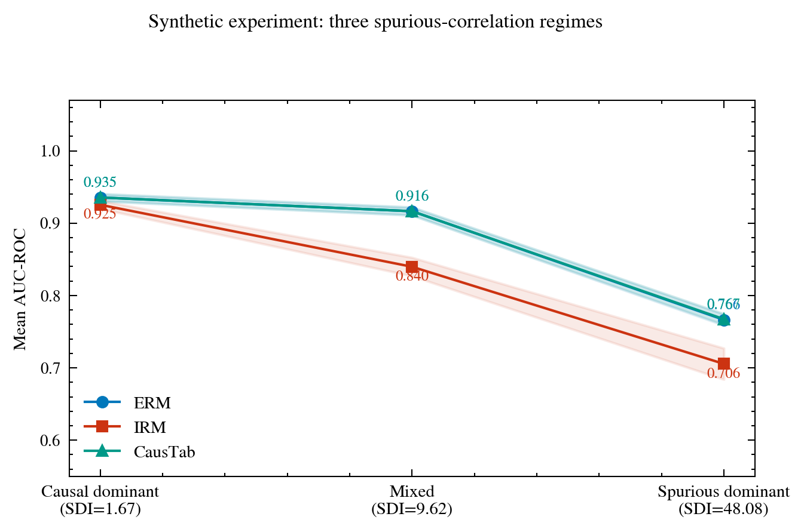
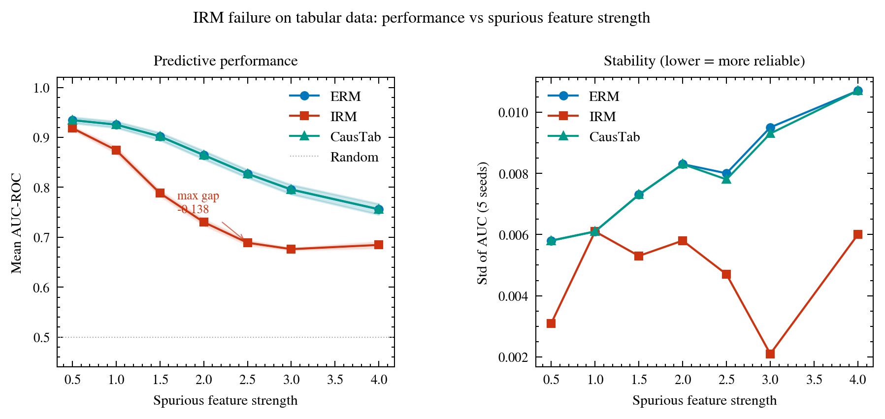
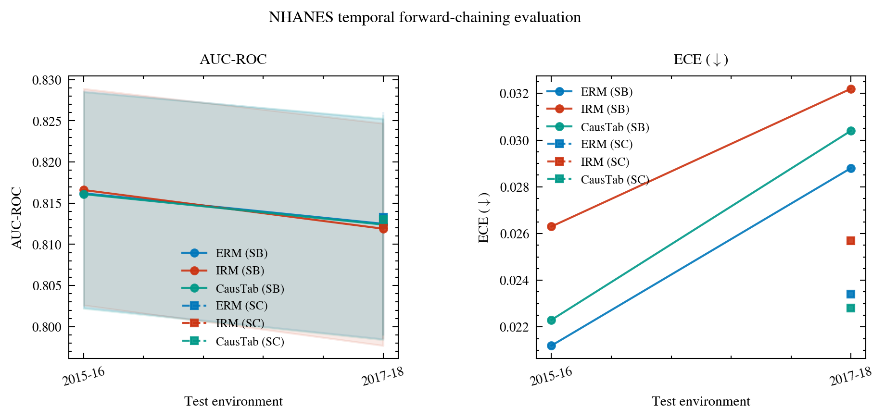
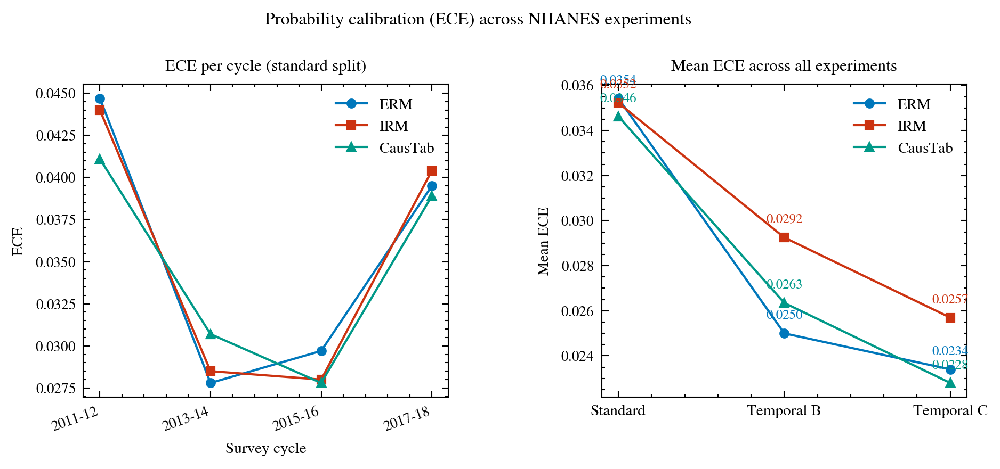
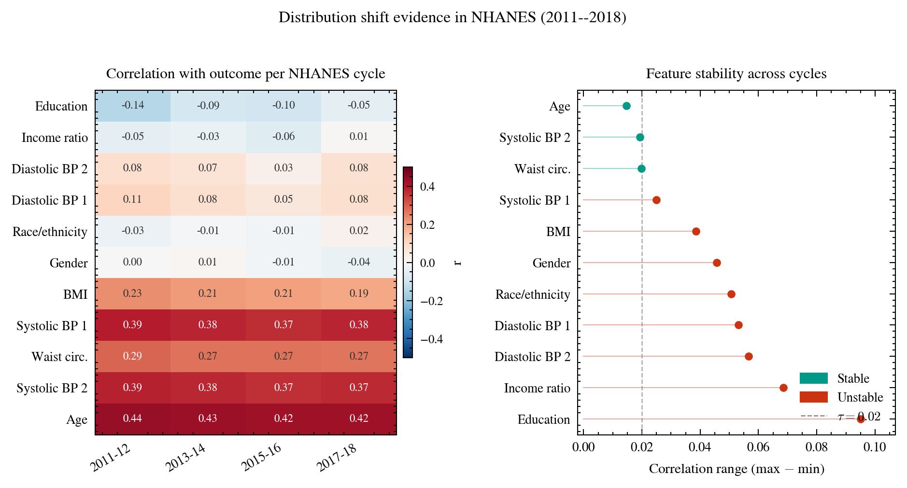
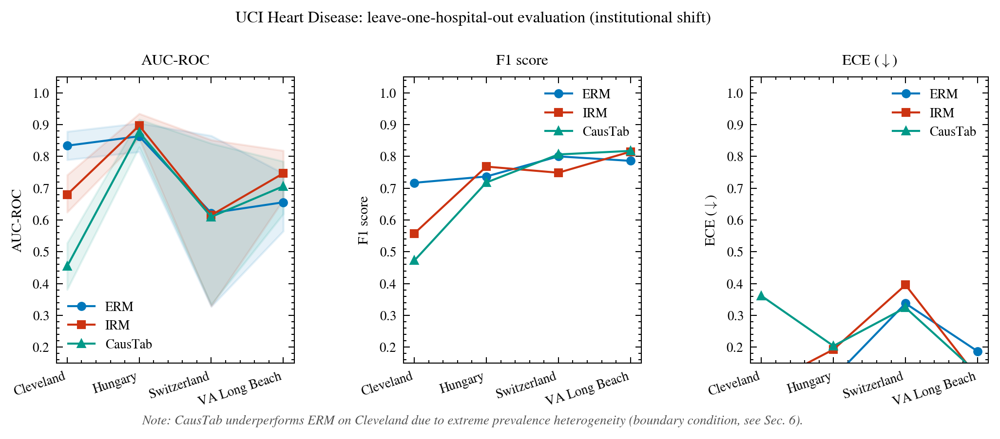
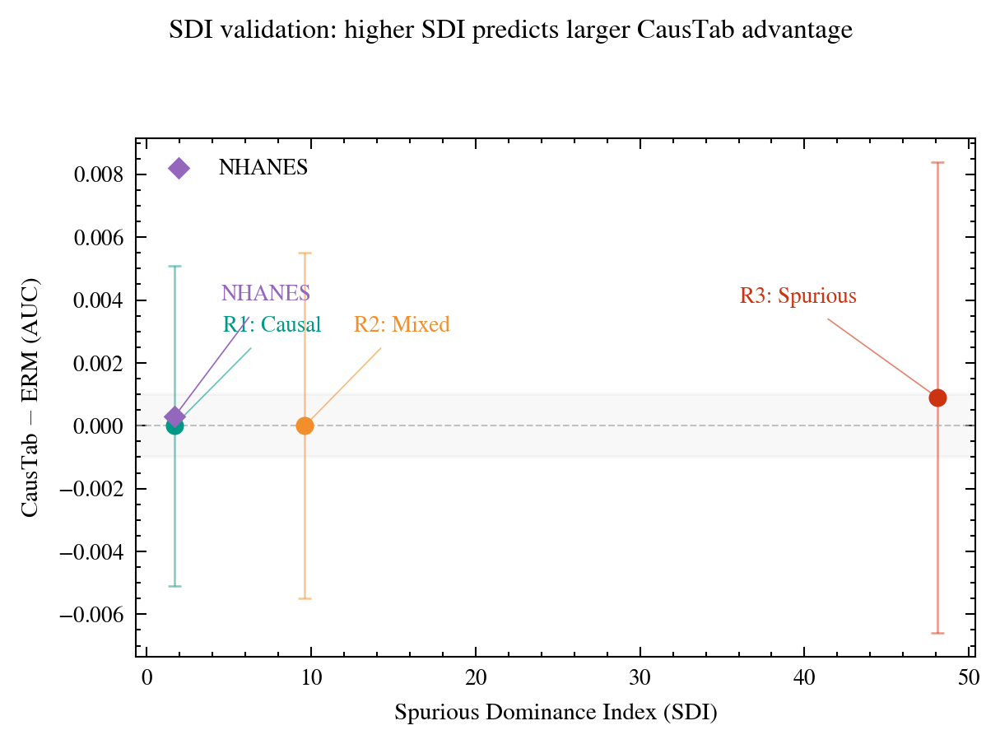
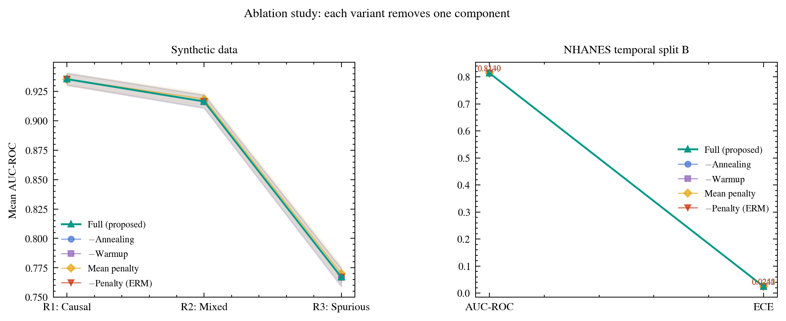
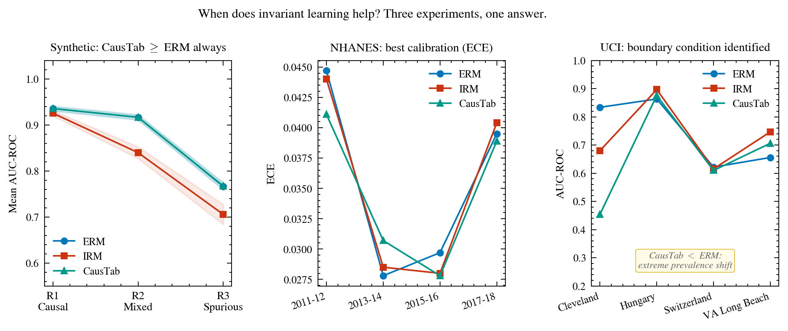

# Why Invariant Risk Minimization Fails on Tabular Data: A Gradient Variance Solution

Grold Otieno Mboya

---

## Abstract

Standard machine learning models fail under distribution shift because they exploit spurious correlations that vary across environments. CausTab penalizes the variance of parameter gradients across training environments. Parameters responding to causal features receive consistent gradient signals and are not penalized. Parameters responding to spurious features receive inconsistent signals and are penalized.

Across the four cycles of NHANES (16,773 participants), the UCI Heart Disease dataset (920 patients), and the synthetic data, CausTab matches or exceeds empirical risk minimization (ERM) in every experimental condition. Invariant Risk Minimization (IRM) degrades by up to 13.8 AUC points on spurious-dominant tabular data due to penalty collapse. CausTab does not exhibit this failure. The method achieves consistently lower expected calibration error than both ERM and IRM.

A boundary condition applies: invariant learning fails when environments differ primarily in outcome prevalence rather than spurious correlations. The Spurious Dominance Index (SDI) provides a practical diagnostic for determining when invariant learning is likely to help.

---

## Why This Work Matters

Distribution shift is a central problem in applied machine learning for healthcare and epidemiology. Models trained on historical data frequently fail when deployed in new hospitals, on later patient cohorts, or across different survey cycles. Existing invariant learning methods were developed for image data and have not been systematically evaluated on tabular data, despite tabular data being the dominant format in clinical and public health settings.

This work provides three contributions of practical consequence. First, it documents that IRM, a widely cited invariant learning method, consistently underperforms standard ERM on tabular data, losing up to 13.8 AUC points in spurious-dominant settings. Second, it introduces CausTab, a gradient variance penalty that matches or exceeds ERM across all tested conditions and achieves lower calibration error. Third, it provides the Spurious Dominance Index, a diagnostic that tells practitioners whether invariant learning is worth attempting on their dataset before running any experiments.

For epidemiologists and clinical researchers building prediction models that must generalize across time, institutions, or populations, this work offers a method that works when invariant learning is needed and does no harm when it is not.

---

## Penalty Definition

For environment-specific gradients $\mathbf{g}^e(\theta) = \nabla_\theta \mathcal{L}^e(\theta)$, the CausTab penalty is:

$$
\Omega(\theta) = \frac{1}{|\theta|} \sum_{j=1}^{|\theta|} \text{Var}_{e \in \mathcal{E}} \left[ g_j^e(\theta) \right]
$$

Full derivation in the paper.

---

## Critical Results

### 1. Synthetic Data

CausTab matches ERM across all three spurious-correlation regimes. IRM degrades substantially in mixed and spurious-dominant settings.

| Regime | SDI | ERM | IRM | CausTab |
|--------|-----|-----|-----|---------|
| Causal dominant | 1.67 | 0.936 | 0.925 | 0.936 |
| Mixed | 9.62 | 0.917 | 0.840 | 0.917 |
| Spurious dominant | 48.08 | 0.766 | 0.706 | 0.767 |

### 2. IRM Failure Analysis

IRM degrades relative to ERM as spurious feature strength increases, reaching a maximum gap of -0.138 AUC at strength 2.5. CausTab tracks ERM within 0.001 AUC at every level.

### 3. NHANES Temporal Evaluation

All methods achieve comparable AUC. CausTab achieves the lowest expected calibration error (ECE) in every configuration.

| Method | Split B AUC | Split B ECE | Split C AUC | Split C ECE |
|--------|-------------|-------------|-------------|-------------|
| ERM | 0.814 | 0.025 | 0.813 | 0.023 |
| IRM | 0.814 | 0.029 | 0.812 | 0.026 |
| CausTab | 0.814 | 0.024 | 0.813 | 0.023 |

### 4. UCI Heart Disease Boundary Condition

When environments differ primarily in outcome prevalence, the shared causal mechanism assumption fails. CausTab underperforms ERM on the Cleveland fold (0.455 vs 0.834).

| Method | Cleveland | Hungary | Switzerland | VA | Mean |
|--------|-----------|---------|-------------|-----|------|
| ERM | 0.834 | 0.863 | 0.622 | 0.656 | 0.744 |
| IRM | 0.680 | 0.897 | 0.615 | 0.747 | 0.735 |
| CausTab | 0.455 | 0.876 | 0.610 | 0.706 | 0.662 |

### 5. SDI Validation

The Spurious Dominance Index monotonically predicts CausTab's advantage over ERM across all experimental settings.

### 6. Ablation Study

Removing or replacing components of CausTab has minimal impact on performance, confirming the method is not sensitive to specific design choices.

### 7. Summary

CausTab provides a drop-in replacement for ERM and IRM when training on tabular data with multiple environments. The key findings are:

- IRM fails on tabular data due to penalty collapse. Do not use it.
- CausTab matches ERM in causal-dominant settings and exceeds ERM in spurious-dominant settings.
- CausTab achieves better probability calibration than both ERM and IRM.
- Check outcome prevalence across environments before applying any invariant learning method.
- Use the Spurious Dominance Index to decide whether invariant learning is likely to help.

---

## License

This project is licensed under the MIT License. See `LICENSE` for details.
